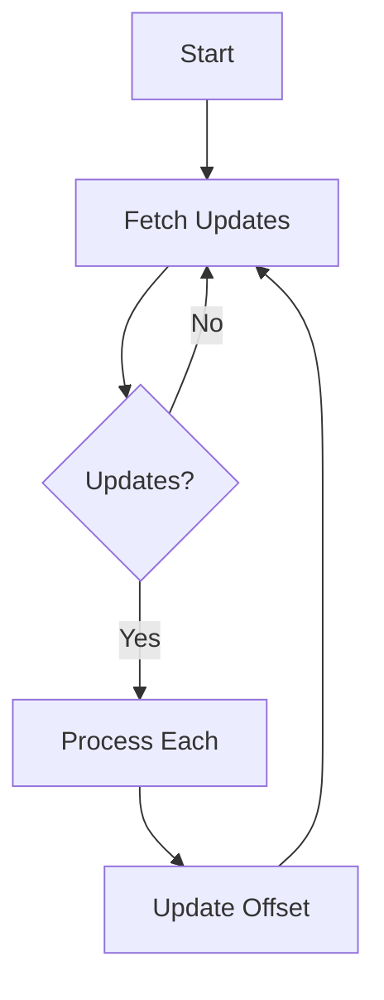

# BaseListener

## Package
```python
from surfgram.core.listeners import BaseListener
```

## Class Description
The `BaseListener` implements the core polling mechanism for Telegram bot updates, providing:
- Continuous update fetching
- Automatic offset management
- Type-based handler dispatching

## Constructor
```python
__init__(offset: int = 0, timeout: int = 30) -> None
```

### Parameters
| Parameter | Type | Default | Description |
|-----------|------|---------|-------------|
| `offset`  | int  | 0       | Initial update ID to resume from |
| `timeout` | int  | 30      | Long-polling timeout in seconds |

## Public Methods

### Event Loop
```python
async listen(bot: Bot) -> None
```

#### Description
Main event loop that continuously:
1. Fetches updates via `get_updates`
2. Processes each through `on_update`
3. Manages update offsets automatically

#### Flow


### Update Handler
```python
async on_update(update: APIObject, bot: Bot) -> None
```

#### Processing Pipeline
1. Logs raw update at `API` debug level
2. Resolves appropriate handler via `TypesFactory`
3. Creates executable instance
4. Invokes registered callback

## Internal Method

### Update Fetcher
```python
async _get_updates(bot: Bot) -> List[Dict[str, Any]]
```

#### Behavior
- Wrapper for `bot.get_updates` API call
- Returns empty list on no updates
- Handles response parsing (extracts `result` field)

## Configuration Guidance

### Standard Usage
```python
# In your config.py
from surfgram.core.listeners import BaseListener

class MyConfig(BaseConfig):
    # ....
    __listener__ = BaseListener
```

### Custom Listeners
Subclass to modify behavior:
```python
class CustomListener(BaseListener):
    async def on_update(self, update, bot):
        # Pre-processing logic here
        await super().on_update(update, bot)
```

> **See Also**: [Configuration Documentation](https://github.com/surfgram/surfgram-docs/blob/main/structures/config.md) for proper listener setup.

